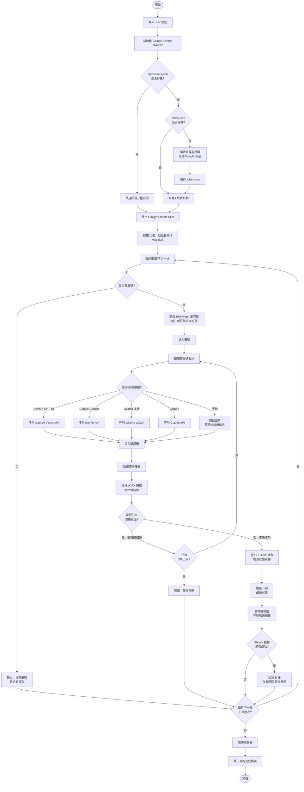

# test_playwrite_google_sheet
# 新竹物流自動查詢系統

自動從 Google Sheets 試算表讀取貨物單號，前往新竹物流網站查詢物流狀態，並將最新狀態回寫至試算表。

---

## 專案架構

```
task1/
├── hctSearch.js          # 主程式：查詢流程、驗證碼辨識、Sheets 回寫
├── fetchSheet.js         # 工具腳本：單獨分析試算表中的日期與單號
├── .env                  # 環境變數設定（API Keys、模式選擇）
├── credentials.json      # Google OAuth2 憑證（需自行從 Google Cloud 下載）
├── token.json            # Google OAuth2 token（首次授權後自動產生）
├── captcha_current.png   # 每次查詢時截取的驗證碼圖片（自動產生）
├── result_*.png          # 各單號的查詢結果截圖（自動產生）
└── package.json
```

### 程式流程圖



---

## 環境需求

- Node.js v18 以上
- npm
- Playwright（Chromium）

---

## 安裝

```bash
npm install
npx playwright install chromium
```

---

## 設定（.env）

```env
# 驗證碼辨識提供者：openai / gemini / ollama / claude / manual
CAPTCHA_PROVIDER=openai

# OpenAI API Key（使用 GPT-4o 辨識驗證碼）
OPENAI_API_KEY=sk-...

# Anthropic Claude API Key（選用）
ANTHROPIC_API_KEY=sk-ant-...

# Google Gemini API Key（選用，免費申請：https://aistudio.google.com/app/apikey）
GEMINI_API_KEY=...

# Ollama 設定（本機模型，完全免費）
OLLAMA_URL=http://localhost:11434
OLLAMA_MODEL=llava

# Google Sheets 回寫：OAuth2 憑證路徑
GOOGLE_CREDENTIALS_FILE=credentials.json
```

---

## 驗證碼辨識模式

| 模式 | 說明 | 費用 |
|------|------|------|
| `openai` | GPT-4o Vision（準確率高） | 付費 |
| `gemini` | Google Gemini 1.5 Flash | 免費額度 |
| `ollama` | 本機 LLaVA 模型 | 完全免費 |
| `claude` | Claude Haiku Vision | 付費 |
| `manual` | 程式截圖後等待手動輸入 | 免費 |

> 辨識失敗或 API 無法使用時，自動切換為手動輸入模式。

---

## Google Sheets 回寫設定（一次性）

1. 前往 [Google Cloud Console](https://console.cloud.google.com)，建立專案
2. 啟用 [Google Sheets API](https://console.cloud.google.com/apis/library/sheets.googleapis.com)
3. 建立 OAuth 2.0 憑證（電腦版應用程式）→ 下載 JSON → 命名為 `credentials.json` 放入專案根目錄
4. 至「OAuth 同意畫面」→ 測試使用者 → 加入自己的 Google 帳號

---

## 使用方式

### 主程式（查詢並回寫）

```bash
node hctSearch.js
```

**首次執行**：瀏覽器自動開啟 Google 授權頁面 → 允許後繼續，token 自動儲存。

**執行結果範例**：
```
日期：3/29（第 44 列）
  → 單號：1111770575（第 45 列）
  [驗證碼] openai 辨識：「2793」
  → 狀態：成功
  → 結果：
    作業時間              貨物狀態          件數   業者所
    ------------------------------------------------------------
    2026/04/07 09:39   順利送達   1 件   三民
    2026/04/07 07:50   配送中     1 件   三民
    ...
  [Sheets] B45 寫入：2026/04/07 09:39 順利送達
```

試算表回寫結果：

| A 欄（單號） | B 欄（最新狀態，自動填入） |
|---|---|
| 1111770575 | 2026/04/07 09:39 順利送達 |
| 1111770903 | 2026/04/07 09:39 順利送達 |
| 1111725171 | 2026/04/02 16:24 順利送達 |

### 分析腳本（只讀取，不查詢）

```bash
node fetchSheet.js
```

僅讀取試算表並在終端機輸出日期與單號分析，不開啟瀏覽器。

---

## 試算表格式規範

程式會自動識別以下結構：

```
A 欄
─────────────────────
3/29          ← 日期（M/D 格式）
1111770575    ← 單號（日期正下方一格）
              ← 空白 = 此批次無單號
3/28
1111770903
...
```

> 僅支援 `M/D` 格式日期（如 `4/6`、`3/31`），月份需為 1–12，日期需為 1–31。
